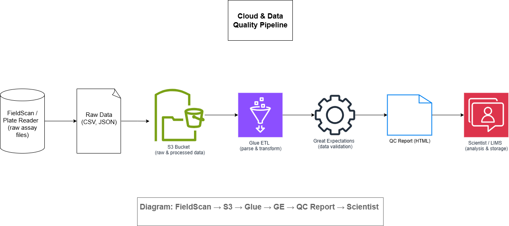

# EPAM Life‑Science Business Analyst Portfolio  
**Seyedsajjad Haghi**

---

## Overview  
This repository demonstrates my end‑to‑end Business Analyst skills for life‑science R&D digitalisation: system design, data modelling, Agile user stories, cloud/QC pipelines, product roadmaps, and more.  

---

## Table of Contents  
- [System Artefacts](#system-artefacts)  
- [Business Artefacts](#business-artifacts)  
- [Product Artefacts](#product-artifacts)  
- [Cloud & Data Quality Demo](#cloud--data-quality-demo)  
- [Glossary](#glossary)  
- [Five‑Slide Mini‑Case](#five-slide-mini-case)  
- [competency](#competency)  
- [Contact](#contact)  

---

## 🛠️ System Artefacts  
Demonstrates mapping of actors, data flows, and APIs for a CHO cell‑engineering pipeline.  
- [Context Diagram](./system_artifacts/context_diagram.png)  
- [3‑Step BPMN](./system_artifacts/pipeline_bpmn.png)  
- [ER Diagram](./system_artifacts/er_diagram.png)  
- [OpenAPI Spec (YAML)](./system_artifacts/gsko_api.yaml)  
- [Data Dictionary (Markdown)](./system_artifacts/data_dictionary.md)  

---

## 📋 Business Artefacts  
Shows breaking high‑level goals into Epics, User Stories, and stakeholder maps.  
- [Jira Kanban Board](./business_artifacts/jira_kanban_biolord.png)  
- [Stakeholder Matrix](./business_artifacts/stakeholder_matrix.png)  

---

## 📈 Product Artefacts  
Illustrates product‑management thinking: value definition, planning, and metrics.  
- [Lean Canvas](./product_artifacts/lean_canvas_gs_ko.png)  
- [Project Roadmap](./product_artifacts/roadmap_gs_ko.png)  

---

## ☁️ Cloud & Data Quality Demo  
Highlights data‑ingest and QC pipeline architecture.  
  
Full‑size view: [cloud_qc_flow.png](./cloud_artifacts/cloud_qc_flow.png)  

---

## 🧬 Glossary  
A shared vocabulary of key life‑science and data terms:  
[glossary_biologicals.md](./glossary_biologicals.md)  

---

## 📄 Five‑Slide Mini‑Case  
A concise deck (context → data model → user stories → QC) for interview walkthroughs:  
[mini_case.pdf](./mini_case/mini_case.pdf)  

---

## 🧠 Competency Letter  
A personal statement demonstrating how my lab background, bioinformatics expertise, and BA preparation align with the Life‑Science BA role at EPAM:  
[Competency Letter/README.md](./Competency%20Letter/README.md)
 

---

## ✉️ Contact  
- **Email:** sajjadhaghi1998@gmail.com  
- **LinkedIn:** https://www.linkedin.com/in/sajjad-haghi-96a1ba209  
