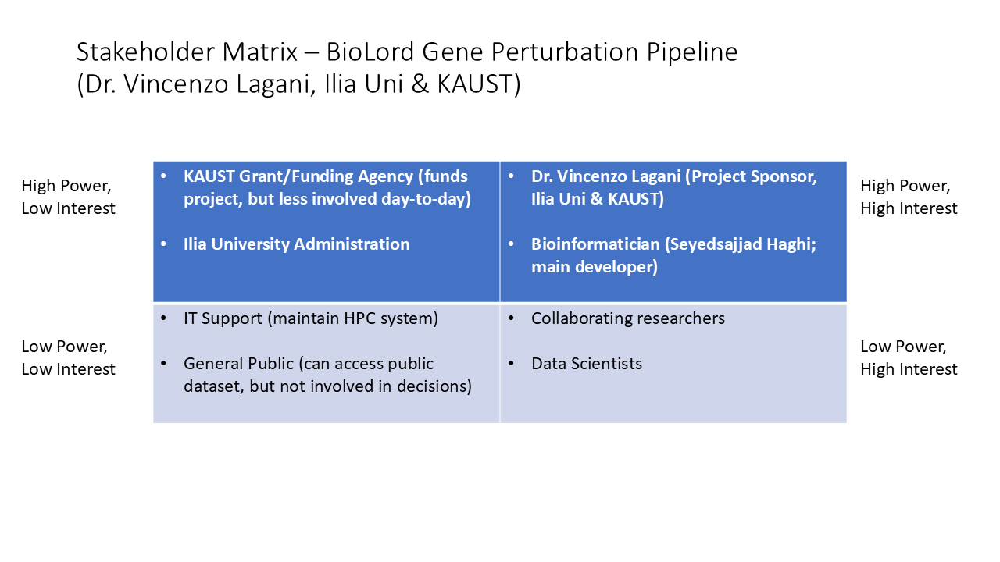

### Jira Kanban Board — BioLord Demo

This screenshot shows real Epics and User Stories for a gene perturbation analysis pipeline, demonstrating business analysis skills in an Agile tool (Jira).

---

### Stakeholder Matrix (BioLord Project)

This matrix shows real stakeholders for the BioLord gene perturbation pipeline developed for Dr. Vincenzo Lagani (Ilia Uni, KAUST).

