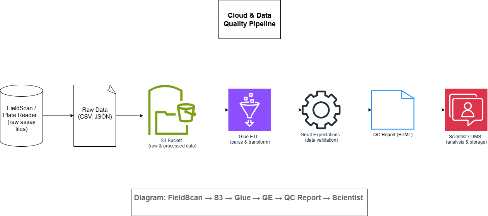

# Cloud & Data Quality Demo

This artefact demonstrates a typical lab data ingest and QC pipeline:

- **cloud_qc_flow.png**: Architecture diagram showing  
  1. FieldScan / Plate Reader (raw assay files)  
  2. Amazon S3 bucket for storage  
  3. AWS Glue ETL for parsing/transforming  
  4. Great Expectations for data validation  
  5. QC report (HTML)  
  6. Scientist / LIMS for downstream use  
