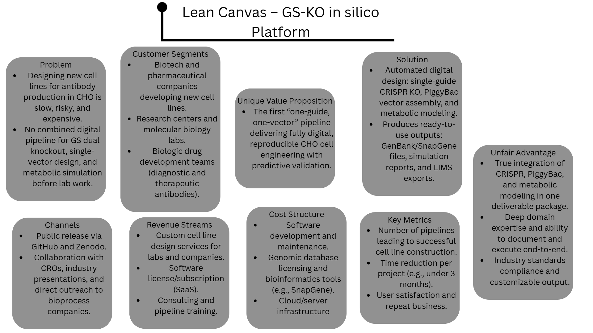
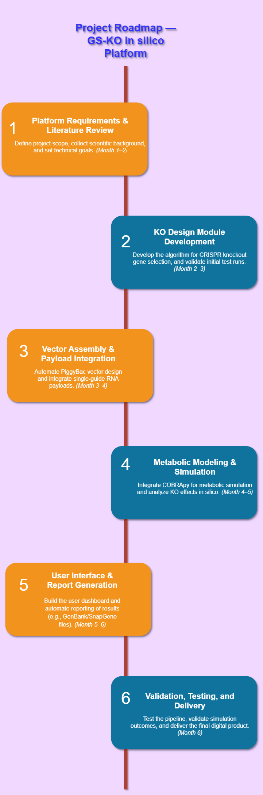

# Product Artefacts

This section contains product management artefacts demonstrating business and market thinking for life science platforms.

---

## Lean Canvas: GS-KO in silico Platform

A one-page summary of the product concept, customer segments, value proposition, and business model for the CHO cell engineering digital pipeline.

*File available as [PNG](./lean_canvas_gs_ko.png) 

---

## Project Roadmap: GS-KO in silico Platform

A high-level timeline showing all major phases and deliverables from literature review to final validation.

