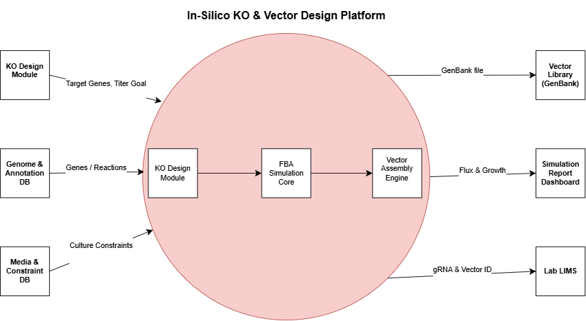
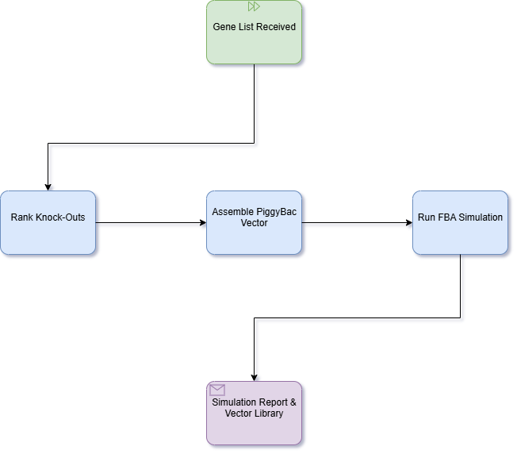
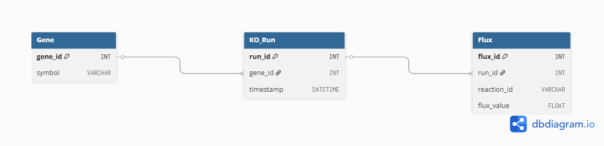

# System Context — In-Silico KO & Vector Design Platform

This diagram shows the **proposed workflow** from my MSc thesis for gene knock-out selection and PiggyBac vector design to improve CHO cell productivity under metabolic-selection conditions.

## High-Level Data Flow

1. **Research Scientist** submits target genes and desired production titer.  
2. The platform conceptually ingests data from:  
   - **Genome & Annotation DB** (CHO gene sequences, reactions, GPR associations)  
   - **Media & Constraint DB** (culture medium composition, uptake/secretion limits)  
3. **Core modules** process the data in order:  
   1. _KO Design Module_ — ranks candidate knock-outs via essential reaction analysis  
   2. _FBA Simulation Core_ (COBRApy) — models flux distribution under selection constraints  
   3. _Vector Assembly Engine_ — generates PiggyBac vector maps with chosen gRNA  
4. **Outputs**:  
   - **Simulation Report** (growth rate, by-product flux, biomass yield)  
   - **Vector Library** (GenBank files) ready for cloning  
   - **Optional LIMS export** (gRNA & vector metadata)

> **Purpose:** Demonstrate my **System Analysis** skills by mapping external actors, data sources, and core processes in one context diagram.

---

**Full thesis details:**  
https://github.com/seyedsajjad98/gs-ko-cho-in-silico/blob/main/docs/DHF_CHO_GS_KO.md  

---

### Process Flow (BPMN)

---

### API Endpoint (OpenAPI Example)

A sample OpenAPI spec (Swagger) for retrieving flux results of a knockout run:

[gsko_api.yaml](./gsko_api.yaml)

### Data Structure (ER Diagram)

